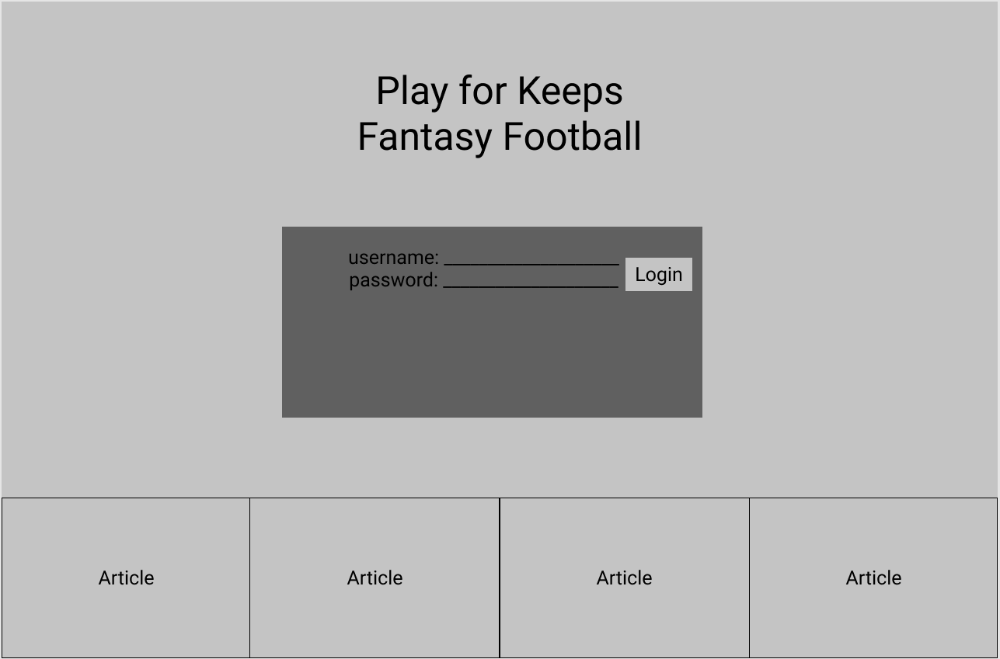
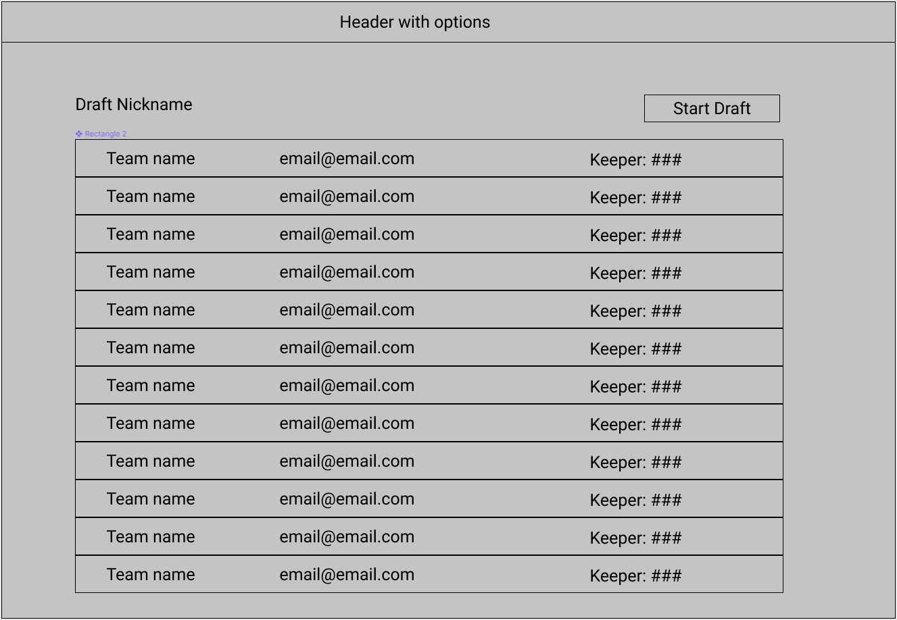
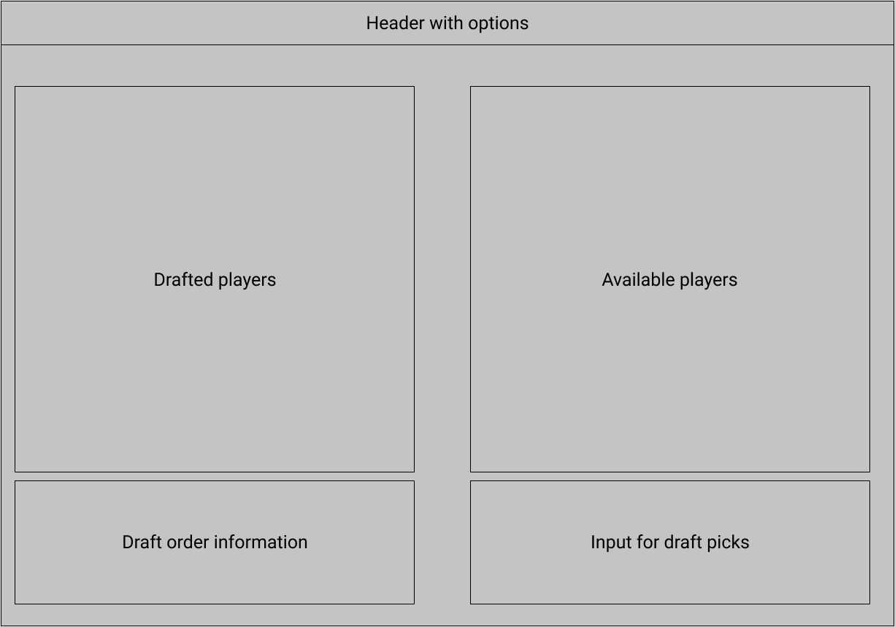
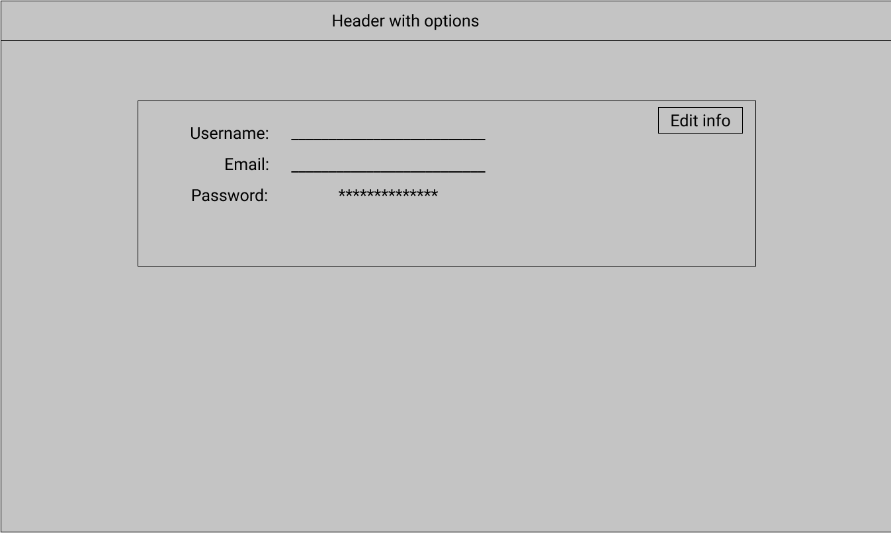
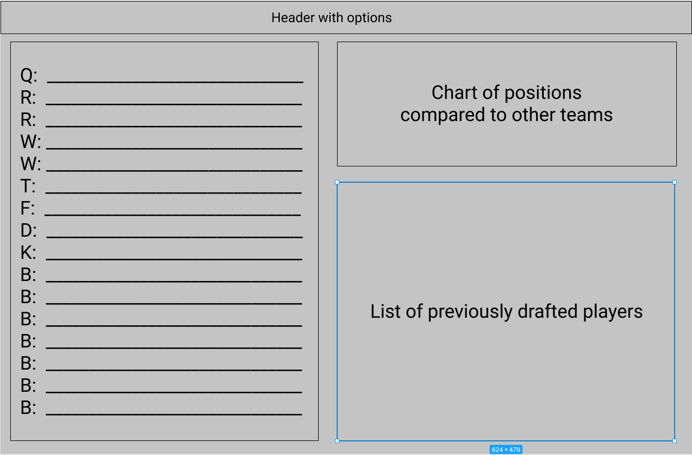
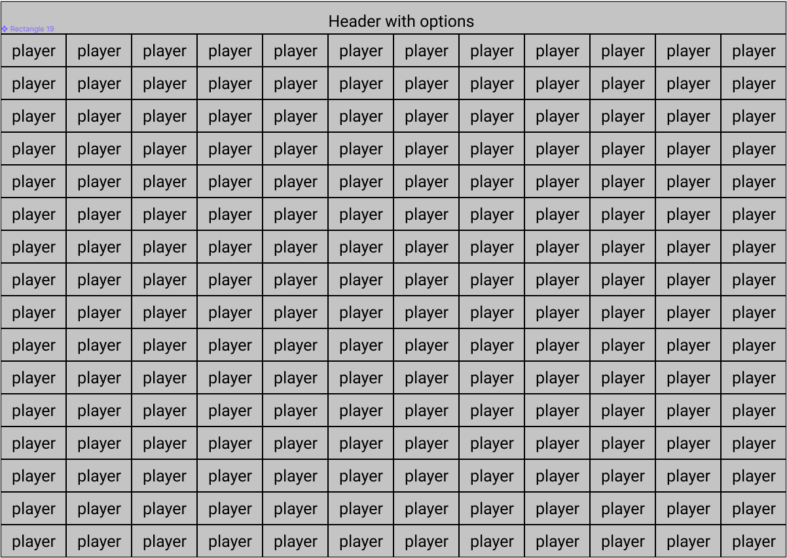
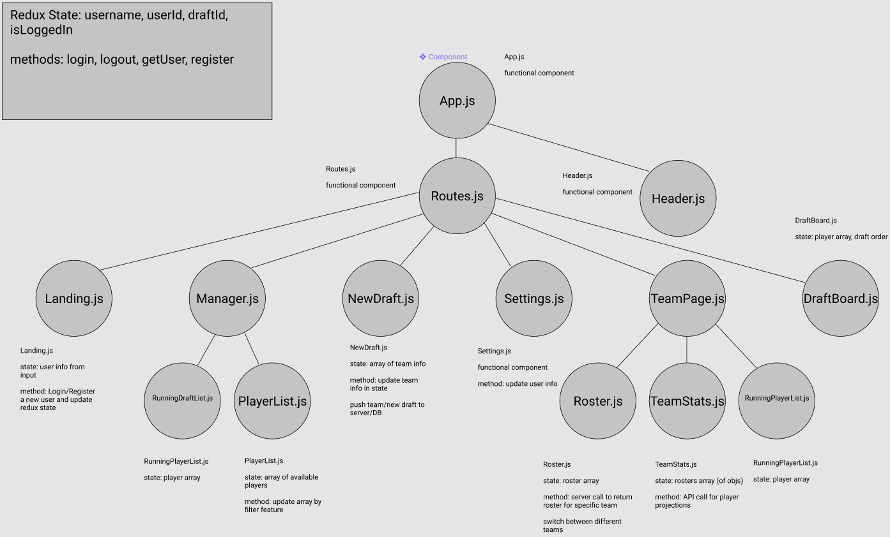
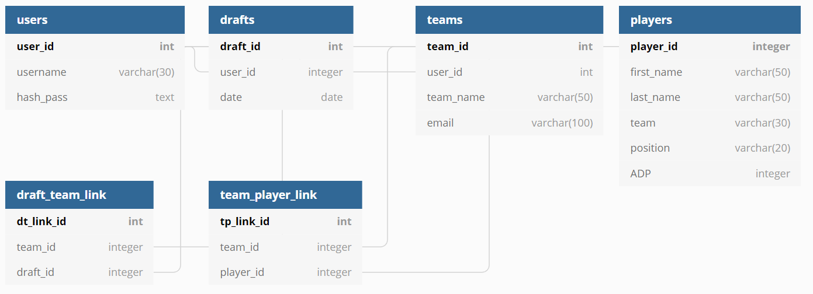

# Fantasy Football Draft App

## Front End

### Purpose

This application is designed to assist fantasy football leagues that prefer offline drafts by providing an efficient way to display a live draft board and give each team visibility to their team's roster as the draft occurs.

### MVP

- Can obtain player information from ESPN's API (will use another API if ESPN's is too difficult to incorporate).
- Can store league, team, player and authentication info on the server.
- Draft board will display entire draft live as picks are entered on a different view. (_animations for new picks with sound effects_)
- _Will display individual team rosters as draft is compiling._

### Components

- Landing Page

  - Allows draft manager to login for an existing league, or create a new account for the league. (Only league managers will need an account. Individual team pages will be accessible without logins as these are just read-only pages.)

- Draft Manager Page

  - This page is where the league manager can conduct the draft by drafting players to teams, handle trades, add keepers and finalize the draft (send results in email)

- Team Page

  - View point for each team to see their roster compiled live.

- Draft Board
  - This view is intended to be opened on an additional tab that can be casted to a television or accessed by a person's tablet/PC for a convenient view.

### Routes/Tree

- App.js
  - Header.js
  - Routes.js
    - Landing.js
    - Manager.js (_protected view_)
      - RunningDraftList.js
      - PlayerList.js
    - NewDraft.js (_protected view_)
    - AccountSettings.js (_protected view_)
    - TeamPage.js (_responsive_)
      - Roster.js
      - TeamStats.js
      - RunningDraftList.js
    - DraftBoard.js

## Back End

### Schema

- users

  - user_id (PK)
  - username
  - email
  - pass/hash

- drafts

  - draft_id (PK)
  - user_id (FK)
  - date

- draft_team_link

  - dt_link_id (PK)
  - team_id (FK)
  - draft_id (FK)

- teams

  - team_id (PK)
  - team_name
  - email

- team_player_link

  - tp_link_id (PK)
  - team_id (FK)
  - player_id (FK)

- players
  - player_id (PK)
  - first_name
  - last_name
  - team
  - position
  - ADP

### Server

- Auth EPs

  - login (_post; body: username, password_)
  - register (_post; body: username, password, email_)
  - logout (_post; params: userId_)
  - getUser (_get; params: userId_)
  - updateUser (_put; params: userId; body: username, password, email_)
  - deleteUser (_delete; params: userId_)

- Draft EPs

  - draft (_post; params: userId_)

- Team EPs

  - team (_post; params: teamId_)
  - player (_post; params: teamId; body: firstName, lastName, team, position, ADP_)

-Controllers

- login
  - confirms user credentials with DB
  - return (userId, username, email)
- register
  - create new user in DB
  - return (userId, username, email)
- logout
  - destroy user session
  - no return
- update user
  - changes username, email and/or password for user
  - returns new (userId, username, email)
- delete user
  - removes user from DB and any data tied to that user
  - no return
- draft

## WireFrames and Diagrams

- Views

  - Landing
    
  - NewDraft
    
  - ManagerPage
    
  - Settings
    
  - TeamPage
    
  - DraftBoard
    

- Component Tree
  

- Schema
  

### DevMountain Project Points

- Total Points (75)

- Core (30)

  - Redux (10)
  - Hooks (10)
  - Authentication (10)

- Additional Technologies (30)

  - Sass (10)
  - ChartJS (5)
  - NodeMailer (10)
  - CSS in JS (5)

- Hosting (10)

  - Hosted (10)

- Presentation (5)

  - Presented, but something was missed (5)
